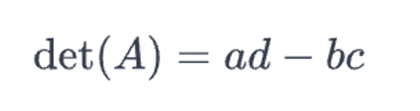

# 선형대수 <br>
by pytorch
### torch.linalg
파이토치에서 **linear algebra**를 구현하기 위한 torch의 서브모듈  

```python
# 라이브러리
import torch
```

<br>

## 행렬식
* 행렬이 **역행렬**을 가지는지 여부를 결정한다
    * 행렬식 = 0 : 역행렬을 가지지 않는다
    * 행렬식 != 0 : 역행렬을 가진다
* 행렬의 모든 열(또는 모든 행)이 생성하는 **공간의 부피**를 나타낸다
* 행렬이 선형 변환을 수행할 때 공간이 **얼마나 확장 또는 축소**되는지를 나타낸다
* 선형 독립인 열(또는 행)을 가지고 있는지를 판단한다
### 2x2의 경우


### 일반적인 경우
하지말자 컴퓨터한테 맡기자

> DataLabbit 학부생 간토끼의 데이터마이닝랩
### 코드
```python
matrix = torch.tensor([[1, 2],
                       [3, 4]], dtype = float)

det_matrix = torch.linalg.det(matrix)

print(f"det : {det_metrix}")
```
#### 실행결과
```shell
det : -2.0
```
